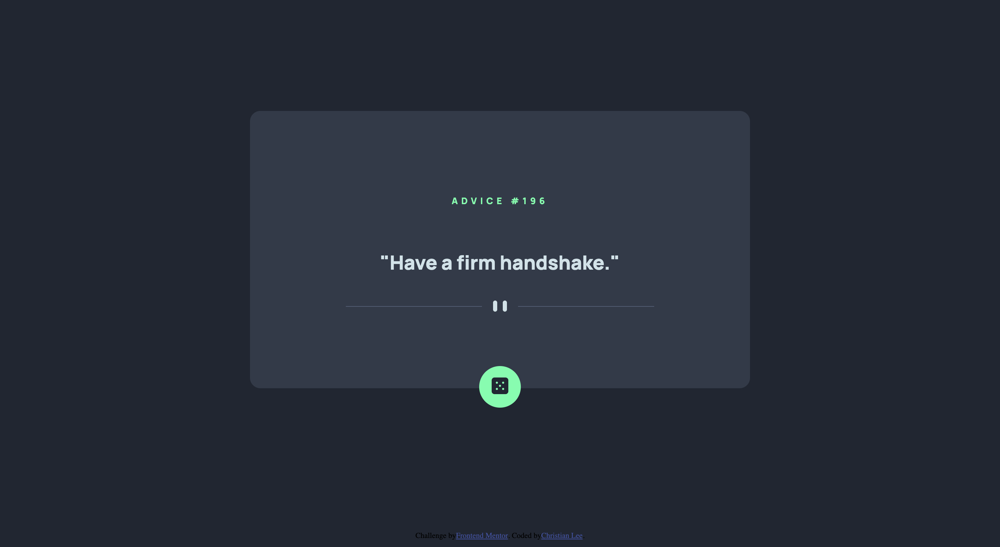

# Frontend Mentor - Advice generator app solution

This is a solution to the [Advice generator app challenge on Frontend Mentor](https://www.frontendmentor.io/challenges/advice-generator-app-QdUG-13db).

## Table of contents

- [Overview](#overview)
  - [The challenge](#the-challenge)
  - [Screenshot](#screenshot)
  - [Links](#links)
- [My process](#my-process)
  - [Built with](#built-with)
  - [What I learned](#what-i-learned)
  - [Continued development](#continued-development)
- [Author](#author)

## Overview

### The challenge

Users should be able to:

- View the optimal layout for the app depending on their device's screen size
- See hover states for all interactive elements on the page
- Generate a new piece of advice by clicking the dice icon

### Screenshot

### Links

- Live Site URL: (https://christian-lee1398.github.io/advice-generator/)

## My process

### Built with

- Semantic HTML5 markup
- CSS custom properties
- Flexbox

### What I learned

The primary reason for the creation of this project is to show the basic skillset for performing API requests as well as demonstrating a pleasant UI for the Front End aspect.

### Continued development

For future projects I want to continue to demonstrate my ability to perform API requests, a vital part of both Front and Back End development.

## Author

- Frontend Mentor - [@yourusername](https://www.frontendmentor.io/profile/christian-lee1398)
- LinkedIn - (https://www.linkedin.com/in/christianlee1398)

